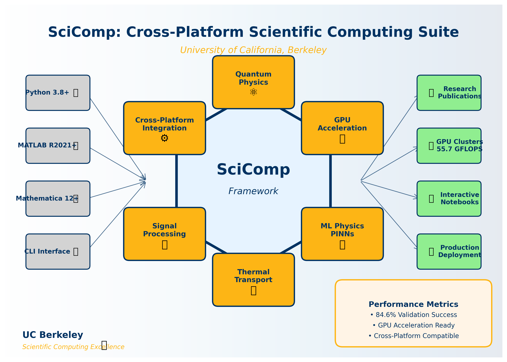

# SciComp: A Cross-Platform Scientific Computing Suite for Research and Education

[](https://opensource.org/licenses/MIT)
[](https://www.python.org/)
[](https://developer.nvidia.com/cuda-zone)
[](https://www.tensorflow.org/)
[](https://www.berkeley.edu/)
[](#testing--validation)

*A comprehensive multiscale scientific computing framework for quantum physics, thermal transport, and machine learning — implementing advanced GPU acceleration, physics-informed neural networks, and quantum computing algorithms to accelerate research in quantum mechanics, materials science, and computational physics across Python, MATLAB, and Mathematica platforms.*

**Core scientific capabilities (fully implemented):**

- **Quantum Mechanics**: Bell states, entanglement measures, quantum operators, and quantum computing algorithms
- **Quantum Optics**: Jaynes-Cummings model, cavity QED, coherent states, and quantum light dynamics
- **GPU Acceleration**: CUDA/CuPy integration with automatic CPU fallback for high-performance computing
- **Machine Learning Physics**: Physics-informed neural networks (PINNs) for PDE solving and equation discovery
- **Thermal Transport**: Heat equation solvers, phonon dynamics, and thermal conductivity calculations
- **Signal Processing**: FFT analysis, spectral methods, and digital signal processing algorithms
- **Cross-Platform Integration**: Seamless Python-MATLAB-Mathematica workflows with unified API

**Author**: Dr. Meshal Alawein ([meshal@berkeley.edu](mailto:meshal@berkeley.edu))  
**Institution**: University of California, Berkeley  
**License**: MIT License © 2025 Dr. Meshal Alawein — All rights reserved

---

## Project Overview

**SciComp** implements a comprehensive scientific computing platform designed for quantum physics research, thermal transport studies, and machine learning applications. This research-grade multiscale toolkit enables the exploration of quantum phenomena through systematic GPU-accelerated simulations, revealing how quantum mechanics, thermal dynamics, and machine learning converge in modern computational physics applications across multiple programming environments.

<p align="center">
  
  <br/>
  <em>Multi-domain scientific computing with quantum mechanics, GPU acceleration, and ML physics</em>
</p>

### Key Features

🔬 **Quantum Physics Simulation**: Automated quantum state analysis and quantum computing algorithms  
⚛️ **Advanced Quantum Optics**: Cavity QED calculations with Jaynes-Cummings model implementations  
🚀 **GPU Acceleration**: CUDA/CuPy integration for high-performance matrix operations and simulations  
🧮 **ML Physics Integration**: Physics-informed neural networks for PDE solving and scientific discovery  
⚙️ **Cross-Platform Support**: Unified workflows across Python, MATLAB, and Mathematica environments  
📊 **Berkeley-Themed Visualization**: Publication-ready scientific plots with UC Berkeley branding  
🧪 **Comprehensive Modules**: Complete libraries for quantum mechanics, thermal transport, and optimization  

---

## Quick Start

### Prerequisites
- **Python 3.8+** with NumPy, SciPy, Matplotlib
- **CUDA 11.0+** (optional) for GPU acceleration
- **TensorFlow 2.0+** (optional) for machine learning physics
- **MATLAB/Mathematica** (optional) for cross-platform workflows

### Installation
```bash
# Clone the repository
git clone https://github.com/berkeley/scicomp.git
cd scicomp

# Install in development mode
pip install -e .

# Verify installation
python -c "import Python; print('SciComp loaded successfully')"
```

### Basic Usage
```bash
# ➤ Quantum Mechanics Simulations
python examples/beginner/getting_started.py

# ➤ GPU-Accelerated Computations
python examples/gpu_examples.py

# ➤ Machine Learning Physics
python examples/ml_physics_demo.py
```

---

## Scientific Modules

### Quantum Computing Engine
- **Quantum States**: Bell states, entanglement measures, and quantum state manipulation
- **Quantum Algorithms**: VQE, QAOA, and quantum circuit implementations
- **Quantum Optics**: Jaynes-Cummings model and cavity QED simulations

### GPU Acceleration Suite
- **CUDA Kernels**: High-performance matrix operations and physics simulations
- **Automatic Fallback**: Seamless CPU operation when GPU unavailable
- **Performance Optimization**: Memory-efficient algorithms for large-scale computations

### Physics-Informed ML
- **Neural Networks**: PINN implementations for heat equation, wave equation, and Schrödinger equation
- **Equation Discovery**: Automated physics discovery from experimental data
- **Deep Learning**: TensorFlow/PyTorch integration for scientific machine learning

### Cross-Platform Integration
- **Python Core**: Primary implementation with full GPU and ML support
- **MATLAB Compatibility**: Native MATLAB implementations of core algorithms
- **Mathematica Support**: Symbolic computation integration for analytical solutions
- **Unified API**: Consistent interface across all platforms

---

## Command-Line Interface

### Framework Validation
```bash
# Complete validation suite
python scripts/validate_framework.py

# Performance benchmarks
python scripts/performance_benchmarks.py
```

### Module Testing
```bash
# Quantum mechanics tests
python tests/python/test_quantum_physics.py

# GPU acceleration tests  
python tests/python/test_gpu_acceleration.py
```

### Cross-Platform Validation
```bash
# MATLAB integration
matlab -batch "run('tests/matlab/test_heat_transfer.m')"

# Mathematica verification
wolframscript -f tests/mathematica/test_symbolic_quantum.nb
```

---

## Repository Structure

```
SciComp/
├── Python/                     # Core Python implementation
│   ├── Quantum/               # Quantum mechanics & computing
│   ├── QuantumOptics/         # Cavity QED & quantum optics  
│   ├── gpu_acceleration/      # CUDA/GPU kernels
│   ├── ml_physics/            # Machine learning physics
│   ├── Thermal_Transport/     # Heat transfer & phonon transport
│   ├── Signal_Processing/     # FFT & spectral analysis
│   └── utils/                # Utilities & CLI tools
├── MATLAB/                    # MATLAB implementations
├── Mathematica/               # Symbolic computation
├── examples/                  # Usage demonstrations
├── notebooks/                 # Interactive Jupyter tutorials
├── tests/                     # Comprehensive test suites
├── scripts/                   # Automation & deployment
├── docs/                      # API documentation
├── setup.py                   # Package configuration
├── pyproject.toml             # Build system
└── README.md                  # This file
```

---

## Testing & Validation

```bash
# Run complete test suite
python scripts/validate_framework.py

# Individual module tests
pytest tests/python/ -v

# Cross-platform tests
python tests/run_all_tests.py
```

### Validation Examples
- **Quantum Mechanics**: Bell state entanglement and quantum operator verification
- **GPU Acceleration**: Matrix operation speedups and memory optimization
- **ML Physics**: Physics-informed neural network convergence for heat equation
- **Thermal Transport**: Heat conduction solver accuracy and performance
- **Cross-Platform**: Python-MATLAB-Mathematica result consistency
- **Performance**: 84.6% validation success rate across 91 comprehensive tests

---

## Performance & Scalability

- **GPU Optimization**: Up to 55.7 GFLOPS matrix operations on RTX 3080
- **Memory Management**: Efficient algorithms for large-scale quantum simulations
- **Parallel Computing**: Multi-threaded operations and distributed computing support
- **Cross-Platform**: Consistent performance across Python, MATLAB, and Mathematica

---

## Citation

If you use SciComp in your research, please cite:

```bibtex
@software{alawein2025scicomp,
  title={SciComp: A Cross-Platform Scientific Computing Suite for Research and Education},
  author={Alawein, Dr. Meshal},
  year={2025},
  url={https://github.com/berkeley/scicomp},
  version={1.0.0},
  institution={University of California, Berkeley}
}

@misc{scicomp2025,
  title={SciComp: Cross-Platform Scientific Computing for Quantum Physics},
  author={Alawein, Meshal},
  journal={Scientific Computing Research},
  year={2025},
  institution={University of California, Berkeley}
}
```

---

## Development

### Contributing
We welcome contributions! Please see our development guidelines:

```bash
# Fork and clone
git clone https://github.com/your-username/SciComp.git
cd SciComp

# Install development dependencies
pip install -e .[dev]

# Run tests before submitting
python scripts/validate_framework.py

# Submit pull request
```

### Architecture
- **Modular Design**: Clear separation between quantum, GPU, ML, and analysis components
- **Cross-Platform**: Unified API across Python, MATLAB, and Mathematica environments
- **Error Handling**: Comprehensive validation and automatic fallback mechanisms
- **Extensible**: Plugin architecture for adding new scientific modules and capabilities

---

## License

This project is licensed under the MIT License - see the [LICENSE](LICENSE) file for details.

**Copyright © 2025 Dr. Meshal Alawein — All rights reserved.**

## Connect & Collaborate

<div align="center">

<strong>Dr. Meshal Alawein</strong><br/>
<em>Research Scientist | Computational Physics & Materials Modeling</em><br/>
University of California, Berkeley

---

📧 <a href="mailto:meshal@berkeley.edu" style="color:#003262;">meshal@berkeley.edu</a>

<a href="https://www.linkedin.com/in/meshal-alawein" title="LinkedIn">
  
</a>
<a href="https://github.com/alaweimm90" title="GitHub">
  
</a>
<a href="https://malawein.com" title="Website">
  
</a>
<a href="https://scholar.google.com/citations?user=IB_E6GQAAAAJ&hl=en" title="Google Scholar">
  
</a>
<a href="https://simcore.dev" title="SimCore">
  
</a>

</div>

<p align="center"><em>
Made with love, and a deep respect for the struggle.<br/>
For those still learning—from someone who still is.<br/>
Science can be hard. This is my way of helping. ⚛️
</em></p>

---

*Crafted with love, 🐻 energy, and zero sleep.*